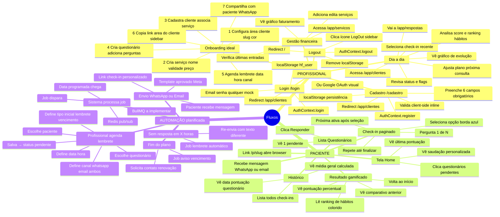
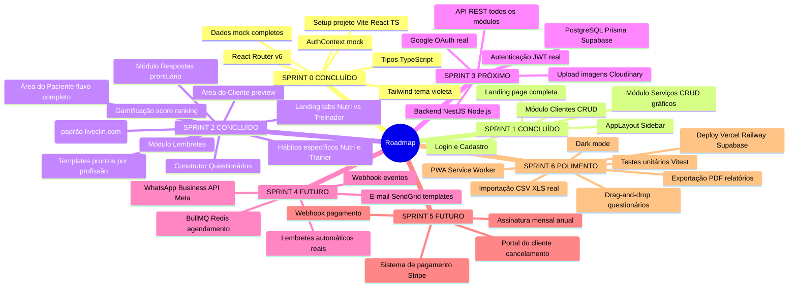

# CANVAS — Mapa Mental do Ecossistema HealthFlow
> Baseado no mapeamento_liveclin.md + implementação real do sistema
> Última atualização: 26/05/2026 — cor primária alterada de roxo para AZUL (padrão liveclin.com)

---

## MAPA MENTAL GERAL DO ECOSSISTEMA

```mermaid
mindmap
  root((HealthFlow))
    USUÁRIOS
      Profissional de Saúde
        Nutricionista
        Treinador Pessoal
        Fisioterapeuta
        Psicólogo
        Médico
      Paciente / Cliente
        Acessa via browser
        Sem instalar app
        Mobile-first
    PAINEL DO PROFISSIONAL /app
      Gestão de Clientes /app/clientes
        Listagem com abas
          Ativos
          Finalizados
          Inativos
          Todos
        Busca em tempo real
        Paginação 15 por página
        Flag de atenção toggle
        WhatsApp direto
        Modal adicionar cliente
        Importar CSV/XLS botão
      Serviços /app/servicos
        Dashboard financeiro
          Gráfico barras Recharts
          Total período
          Total vendas
          Ticket médio
          Últimas entradas
        Tabela de serviços
          Nome Status Validade
          Modalidade Preço Vendas
          Faturamento Editar
        Modal CRUD
          Presencial ou Online
          Validade em dias
          Preço R$
      Questionários /app/questionarios
        Cards expansíveis
        Construtor dinâmico modal
          Tipo Escala padrão 4pt
          Tipo Múltipla Escolha
          Tipo Aberta textarea
          Edição inline de opções
          Pontuação por opção
          Ordem com GripVertical
        CRUD completo
          Criar Editar Excluir
      Respostas /app/respostas
        Lista check-ins clicável
        Prontuário digital
          Score percentual
          Comparativo anterior
          TrendingUp TrendingDown
        Ranking de hábitos
          Ótimo verde
          Bom violeta
          Regular âmbar
          Ruim vermelho
        LineChart evolução
          Recharts ResponsiveContainer
          6 semanas de dados
        Filtro por categoria
      Lembretes /app/lembretes
        Stats Pendente Enviado Falhou
        Tabela completa
          Cliente Questionário
          Tipo Data Hora
          Canal Status
        Tipos de lembrete
          Envio inicial
          Lembrete de resposta
          Vencimento de plano
        Canais
          WhatsApp ícone verde
          Email ícone violeta
          Ambos simultâneo
        Modal novo lembrete
      Área do Cliente /app/area-cliente
        Slug customizável
        healthflow.app/p/slug
        Título e profissão
        Upload foto perfil 400x400
        Upload capa 1080x1920
        Color picker primária
        Color picker secundária
        Preview tempo real
        Botão Ir para área
    ÁREA DO PACIENTE /p/slug
      Sem login necessário
      Tela Home
        Header azul primary-600 profissional
        Saudação personalizada
        Questionários pendentes badge
        Histórico de respostas
        Última pontuação 85%
        Indicador on-line
      Lista de Questionários
        Cards pendentes
        Tempo estimado
        Botão Responder
      Fluxo Check-in Paginado
        Barra progresso N/Total
        Voltar pergunta anterior
        Tipos de pergunta
          Escala botões selecionáveis borda azul
          Múltipla escolha
          Aberta textarea
        Próxima desabilitado
        Ativa após seleção
      Resultado Gamificação
        Score percentual destaque
        Comparativo anterior
        Ranking de hábitos colorido
        Voltar ao início
      Histórico
        Lista check-ins anteriores
        Data questionário pontuação
        Média geral calculada
    LANDING PAGE /
      Header sticky translúcido
        Logo HealthFlow Zap
        Funções Preços Depoimentos
        Entrar Testar Grátis
        Menu hamburger mobile
      Hero
        Dot-grid fundo azul 93c5fd
        Gradiente eff6ff dbeafe bfdbfe azul
        Badge social proof pulse
        H1 font-black 7xl
        2 CTAs rounded-full
        3 mockups iPhone flutuantes
      Para quem é funcoes
        3 cards hover shadow
        Nutricionistas
        Treinadores
        Profissionais Saúde
      Como funciona 3 passos
        01 Programar
        02 Paciente responde
        03 Profissional revisa
      Área do Cliente
        3 feature cards
        Mockup celular preview real
      Progresso
        Mockup prontuário
        Ranking hábitos colorido
        3 feature cards
      Automações
        3 feature cards
        Painel dark log automações
      Financeiro
        3 cards feature
      Vídeo
        Placeholder player
        Botão play
      Preços precos
        Toggle mensal anual
        R$89 mensal R$75 anual
        Card gradiente azul primary-600 to 800
        10 features checkmarks
        CTA rounded-full
      Depoimentos depoimentos
        7 cards estilo Twitter
        Avatar iniciais
        handle @ azul primary-600
      FAQ 5 perguntas
        Acordeão ChevronDown
        Animação ChevronUp
      CTA Final contato
        Fundo slate-900 dot-grid
        Headline grande
      Footer
        Links navegação
        Copyright 2026
    AUTENTICAÇÃO
      Login /login
        Email + senha
        Toggle mostrar senha
        Google OAuth visual
        Validação client-side
        Link cadastro
        Esqueci senha
      Cadastro /cadastro
        Nome Email Celular
        Senha Confirmar Senha
        Profissão dropdown 7 opções
        Cupom opcional
        Google OAuth visual
        Validação inline por campo
      AuthContext React Context
        user state
        isAuthenticated boolean
        login função mock
        logout limpa localStorage
        register função mock
      Persistência localStorage
        JSON.stringify user
        JSON.parse no init
      PrivateRoute
        Redireciona para /login
      PublicRoute
        Redireciona para /app
```

---

## MAPA MENTAL — ARQUITETURA TÉCNICA DETALHADA

```mermaid
mindmap
  root((Arquitetura Técnica))
    FRONT-END implementado
      Runtime
        Node.js 24 LTS ambiente
        Browser ES2020 target
      Bundler e Build
        Vite 6.0.3
          @vitejs/plugin-react 4.3.4
          HMR Hot Module Replacement
          ESM nativo
          Build output /dist
          vite.config.ts
      Linguagem
        TypeScript 5.6.3
          strict mode true
          jsx react-jsx
          moduleResolution bundler
          noEmit true dev
          tsconfig.json
          tsconfig.node.json
      Framework UI
        React 18.3.1
          StrictMode
          createRoot ReactDOM
          Functional Components
          Hooks useState useEffect useMemo
          Context API AuthContext
      Roteamento
        React Router DOM 6.28.0
          BrowserRouter
          Routes Route
          NavLink isActive styling
          Navigate redirect
          useNavigate hook
          useParams slug paciente
          Outlet layout aninhado
          PrivateRoute wrapper
          PublicRoute wrapper
      Estilização
        Tailwind CSS 3.4.16
          tailwind.config.js
          tema customizado primary azul (alterado 2026-05-26)
          primary-50 eff6ff
          primary-600 2563eb principal
          primary-700 1d4ed8 hover
          utility-first classes
          PostCSS 8.4.49 pipeline
          Autoprefixer 10.4.20
          index.css directives
          dot-grid utility azul 93c5fd
          gradient-hero utility azul eff6ff dbeafe bfdbfe
        Google Fonts
          Inter 400 500 600 700 800 900
          preconnect otimizado
          carregado no index.html
      Ícones
        Lucide React 0.460.0
          60+ ícones SVG utilizados
          Zap Menu X Check
          ChevronDown ChevronUp
          Users Briefcase FileText
          BarChart2 Bell Layout
          BookOpen MessageSquare Gift
          ChevronLeft ChevronRight
          Copy ExternalLink LogOut
          Plus Search Pencil Trash2
          Flag Upload Eye EyeOff
          Loader2 Clock TrendingUp
          TrendingDown GripVertical
          Smartphone Star Shield
          DollarSign ArrowRight Play
          Camera Palette History
          ClipboardList Mail LayoutTemplate
          Apple Dumbbell HeartPulse
          Utensils Scale Droplets Moon
          Activity Target Timer Flame Trophy
      Gráficos
        Recharts 2.13.3
          BarChart barras verticais
          Bar fill 9333ea
          radius 6 6 0 0 arredondado
          LineChart linha evolução
          Line stroke 9333ea strokeWidth 3
          XAxis YAxis sem axisLine
          CartesianGrid strokeDasharray
          Tooltip borderRadius 12px
          ResponsiveContainer 100%
      Formulários
        React Hook Form 7.54.0
          instalado pronto para uso
          validação schema futura
        Validação atual
          useState manual
          check inline por campo
          errors Record string string
      Testes E2E
        Playwright 1.60.0
          @playwright/test devDep
          chromium headless
          screenshots automatizados
          verificação de fluxos
      Estado Global
        React Context API AuthContext
          AuthProvider wraps App
          useAuth hook personalizado
      Estado Local
        useState em cada componente
        useMemo para filtros pesados
        useEffect para side effects
      Persistência cliente
        localStorage
          hf_user JSON serializado
          inicializado no useState
    BACK-END a implementar
      Runtime
        Node.js 20 LTS
        npm ou pnpm
      Framework
        NestJS
          Decorators TypeScript
          Módulos isolados
          Pipes Guards Interceptors
          CLI nestjs/cli
        Alternativa Express
          Middleware chain
          TypeScript com ts-node
      API
        REST JSON
        Versionamento /api/v1
        Swagger OpenAPI docs
        CORS configurado
      Autenticação
        JWT jsonwebtoken
          Access Token 15min
          Refresh Token 7d
          HttpOnly Cookie
        Google OAuth 2.0
          passport-google-oauth20
          Callback /auth/google/callback
        bcrypt hash de senhas
        reCAPTCHA v3 Google
      Validação Back-end
        class-validator NestJS
        Zod alternativa
        DTO Data Transfer Objects
      Módulos da API
        auth login register refresh
        professionals CRUD perfil
        clients CRUD importação
        services CRUD financeiro
        questionnaires CRUD builder
        questions CRUD opções
        check-ins resposta score
        reminders CRUD agendamento
        financial-entries relatórios
        uploads imagens
      Upload de Arquivos
        Multer middleware
        Validação size type
        Destino Cloudinary ou S3
        Sharp redimensionamento
    BANCO DE DADOS a implementar
      PostgreSQL principal
        Supabase gerenciado
        pgBouncer connection pool
        Row Level Security RLS
        Extensões uuid-ossp
      ORM
        Prisma 5.x
          schema.prisma entidades
          migrations automáticas
          seeds dados iniciais
          Prisma Client type-safe
          Studio GUI local
      Redis cache e filas
        Upstash serverless
        Sessões de refresh token
        Cache de consultas frequentes
        BullMQ jobs de lembretes
      Entidades do Banco
        professionals
          id uuid PK
          nome_completo varchar
          email unique
          celular_whatsapp varchar
          senha_hash varchar
          profissao enum
          slug unique
          titulo_profissao varchar
          foto_perfil_url varchar
          capa_cliente_url varchar
          cor_primaria varchar
          cor_secundaria varchar
          plano_assinatura enum
          created_at timestamp
        clients
          id uuid PK
          profissional_id FK
          nome varchar
          whatsapp varchar
          email varchar
          observacao text
          status enum ativo finalizado inativo
          flag boolean
          created_at timestamp
        services
          id uuid PK
          profissional_id FK
          nome varchar
          status enum
          validade_dias integer
          modalidade enum
          preco decimal
          created_at timestamp
        client_services
          id uuid PK
          cliente_id FK
          servico_id FK
          data_inicio date
          data_fim date
          valor_pago decimal
          status enum
        questionnaires
          id uuid PK
          profissional_id FK
          nome varchar
          status enum
          created_at timestamp
        questions
          id uuid PK
          questionario_id FK
          texto text
          tipo enum
          ordem integer
          peso_pontuacao integer
        question_options
          id uuid PK
          pergunta_id FK
          texto varchar
          pontuacao integer
        check_ins
          id uuid PK
          questionario_id FK
          cliente_id FK
          data_resposta timestamp
          pontuacao_total integer
          pontuacao_percentual decimal
        question_responses
          id uuid PK
          checkin_id FK
          pergunta_id FK
          opcao_id FK nullable
          texto_aberto text nullable
        reminders
          id uuid PK
          profissional_id FK
          cliente_id FK
          questionario_id FK
          data_envio_programada timestamp
          tipo enum
          canal enum
          status enum
          created_at timestamp
        financial_entries
          id uuid PK
          profissional_id FK
          cliente_id FK
          servico_id FK
          valor decimal
          data date
    INTEGRAÇÕES
      WhatsApp Business API Meta
        Cloud API gratuita
        Templates aprovados
        Webhook eventos
        Envio programado
        Links de check-in
        Lembretes automáticos
        Avisos de vencimento
      E-mail SendGrid
        Templates HTML
        Tracking abertura
        Bounce handling
        Envio transacional
      Google OAuth 2.0
        Consent screen
        Callback URL
        Scopes profile email
      Google reCAPTCHA v3
        Score threshold 0.5
        Ação de login
        Ação de cadastro
      Cloudinary Storage
        Upload signed
        Transformações automáticas
        Resize 400x400 perfil
        Resize 1080x1920 capa
        CDN global
      YouTube Embed
        Landing page vídeo demo
        Placeholder implementado
      Stripe Pagamentos
        Subscription mensal anual
        Webhook eventos pagamento
        Portal do cliente
        Cancelamento automático
    FILAS E AGENDAMENTO
      BullMQ filas Redis
        Queue send-checkin
        Queue send-reminder
        Queue send-expiry-alert
        Retry automático falhas
        Dashboard Bull Board
      Jobs Agendados
        Cron diário verificar lembretes
        Processar fila de envios
        Cleanup jobs antigos
        Relatório semanal
    DEPLOY E INFRAESTRUTURA
      Front-end Vercel
        Deploy automático GitHub
        Preview branches
        Edge Network CDN
        Domínio healthflow.app
        Env vars Vercel Dashboard
      Back-end Railway
        Container Docker
        Auto-deploy main branch
        Variáveis de ambiente
        Logs em tempo real
        Alternativa Render
      Banco Supabase
        PostgreSQL 15
        Dashboard visual
        Auth integrado opcional
        Storage opcional
        Realtime opcional
      Cache Upstash Redis
        Serverless pay-per-use
        REST API compatível
        BullMQ adapter
      Storage Cloudinary
        Free tier 25GB
        SDK Node.js
        Webhooks upload
      Domínio e DNS
        healthflow.app raiz
        app.healthflow.app painel
        api.healthflow.app backend
```

---

## MAPA MENTAL — DESIGN SYSTEM COMPLETO

```mermaid
mindmap
  root((Design System))
    IDENTIDADE VISUAL
      Nome HealthFlow
      Símbolo Zap Lucide
      Emoji marca 💙 azul
      Tom de voz
        Profissional mas acolhedor
        Português BR informal
        Emojis contextuais
    PALETA DE CORES
      Azul Primária (padrão liveclin.com — alterado 2026-05-26)
        50 eff6ff fundo hero
        100 dbeafe gradiente
        200 bfdbfe dot-grid
        300 93c5fd pontos fundo
        400 60a5fa transições
        500 3b82f6 médio
        600 2563eb PRINCIPAL botões
        700 1d4ed8 hover escuro
        800 1e40af texto forte
        900 1e3a8a título escuro
        950 172554 deep dark
      Neutros Slate
        50 f8fafc bg alternativo
        100 f1f5f9 bg cards internos
        200 e2e8f0 bordas
        400 94a3b8 placeholder texto
        500 64748b texto secundário
        600 475569 texto médio
        700 334155 texto principal
        800 1e293b títulos app
        900 0f172a headings landing
      Status
        Verde 22c55e ativo sucesso
        Âmbar f59e0b pendente atenção
        Vermelho ef4444 erro falhou
        Azul 3b82f6 informativo
    TIPOGRAFIA
      Família Inter Google Fonts
      Pesos carregados
        400 Regular corpo
        500 Medium labels
        600 SemiBold subtítulos
        700 Bold títulos app
        800 ExtraBold h2 landing
        900 Black h1 landing
      Tamanhos Tailwind
        xs 12px labels badges
        sm 14px tabelas formulários
        base 16px corpo padrão
        lg 18px subtítulos
        xl 20px títulos seção
        2xl 24px títulos página
        3xl 30px scores grandes
        4xl 36px h2 landing
        5xl 48px hero destaque
        6xl 60px hero médio
        7xl 72px hero maior
    COMPONENTES
      Botões
        Primary bg-primary-600 rounded-full
        Hover bg-primary-700
        Shadow shadow-primary-200
        Ícone gap-2 ArrowRight
        Disabled opacity-50
        Loading Loader2 animate-spin
        Ghost border border-slate-200
        Danger hover text-red-500
      Cards
        Border border-slate-200
        Radius rounded-2xl 16px
        Shadow shadow-sm
        Hover shadow-md transition
        Padding p-5 ou p-6 ou p-8
        Background bg-white
      Modais
        Overlay bg-black/50 backdrop-blur-sm
        Container rounded-2xl shadow-2xl max-w-md
        Header border-b p-6
        Body overflow-y-auto p-6
        Footer border-t flex gap-3
        Botão fechar X hover text-slate-600
      Tabelas
        Thead bg-slate-50 text-xs uppercase
        Tbody hover:bg-slate-50 transition
        Zebra i%2 bg-slate-50/50
        Border border-slate-100 linhas
        Células px-4 py-3
        Ações ícones com hover color
      Status Badges
        Rounded-full text-xs font-semibold
        Ativo bg-green-100 text-green-700
        Inativo bg-slate-100 text-slate-500
        Pendente bg-amber-100 text-amber-700
        Falhou bg-red-100 text-red-700
        Enviado bg-green-100 text-green-700
        Bom bg-primary-100 text-primary-600
        Ruim bg-red-100 text-red-600
        Regular bg-amber-100 text-amber-600
        Ótimo bg-green-100 text-green-600
      Formulários
        Label text-sm font-medium text-slate-700
        Input border-slate-200 rounded-xl px-4 py-3
        Focus ring-2 ring-primary-400
        Erro border-red-300 bg-red-50
        Erro texto text-xs text-red-500
        Select mesmo estilo do input
        Color picker w-8 h-8 rounded-lg
      Sidebar
        Largura expandida w-64 256px
        Largura colapsada w-16 64px
        Transição duration-300
        Background bg-white border-r
        Item normal text-slate-600
        Item ativo bg-primary-50 text-primary-700 azul
        Item hover bg-slate-50
        Grupo expansível ChevronDown rotate
        Subitem ml-8 text-slate-500
        Badge URL bg-primary-50 border-primary-100 azul
      Gráficos Recharts
        BarChart barras azul 2563eb
        Bar radius 6 6 0 0
        LineChart stroke 2563eb width 3
        Dot fill azul r 5
        ActiveDot r 7
        CartesianGrid stroke f1f5f9
        Axis sem linha sem tick line
        Tooltip borderRadius 12px border e2e8f0
        ResponsiveContainer width 100%
    EFEITOS E ANIMAÇÕES
      Border Radius
        Botões CTA rounded-full 9999px
        Botões ação rounded-xl 12px
        Cards rounded-2xl 16px
        Badges rounded-full
        Modais rounded-2xl 16px
        Avatar rounded-full circular
      Sombras
        sm cards base
        md cards hover
        lg botões CTA primários
        xl modais
        2xl painel paciente celular
      Transições
        duration-200 micro interações
        duration-300 sidebar collapse
        transition-colors hover
        transition-all geral
      Blur
        backdrop-blur-sm overlay modal
        backdrop-blur-md header sticky
      Animações CSS
        animate-pulse dot on-line
        scroll-behavior smooth html
      Gradientes
        gradient-hero 135deg eff6ff dbeafe bfdbfe azul
        hero badge branco translúcido
        capa do paciente bottom to top
        card preços primary-600 to 800 azul
        fundo escuro CTA slate-900
      Dot Grid Pattern
        radial-gradient 93c5fd azul 1px
        background-size 28px 28px
        opacity-40 hero
        opacity-10 CTA final
    RESPONSIVIDADE
      Mobile first approach
        Base styles mobile
        sm 640px breakpoint
        md 768px breakpoint
        lg 1024px breakpoint
        xl 1280px breakpoint
      Landing Page
        Menu hamburger mobile
        1 coluna mobile
        2 colunas sm md
        3 colunas lg grid features
        Mockups iPhone hidden sm
      Painel Profissional
        Sidebar colapsável mobile
        Tabelas colunas ocultas md
        Grid responsivo lg
      Área do Paciente
        max-w-sm centralizado
        Padding 4 em mobile
        Botões w-full
        Texto legível tamanho adequado
```

---

## MAPA MENTAL — FLUXOS DO USUÁRIO

---

## MAPA MENTAL — ESTRUTURA DE ARQUIVOS REAL

```mermaid
mindmap
  root((src/))
    main.tsx
      StrictMode
      createRoot
      AuthProvider
      index.css import
    App.tsx
      BrowserRouter
      AuthProvider
      AppRoutes component
      PrivateRoute
      PublicRoute
      Routes todas as rotas
    index.css
      tailwind base
      tailwind components
      tailwind utilities
      dot-grid custom
      gradient-hero custom
      scroll-behavior smooth
    types/ index.ts
      Professional interface
      Client interface
      Service interface
      QuestionOption interface
      Question interface
      Questionnaire interface
      CheckIn interface
      Reminder interface
      FinancialEntry interface
    data/ mockData.ts
      mockClients 16 registros
      mockServices 4 registros
      chartData 6 meses barras
      mockQuestionnaires 3 com perguntas
      mockCheckIns 4 registros
      progressData 6 semanas linha
      mockReminders 5 registros
      mockFinancialEntries 6 registros
    context/ AuthContext.tsx
      AuthContextType interface
      RegisterData interface
      mockUser constante
      AuthProvider component
      useState user
      localStorage init
      login função async
      logout função
      register função async
      useAuth hook export
    pages/
      LandingPage.tsx
        NAV_LINKS constante
        FEATURES para quem é
        HOW_IT_WORKS 3 passos
        CLIENT_AREA_FEATURES
        PROGRESS_FEATURES
        AUTOMATION_FEATURES
        FINANCIAL_FEATURES
        PRICING_FEATURES lista 10
        TESTIMONIALS 7 depoimentos
        FAQS 5 perguntas
        useState menuOpen scrolled
        useState billingAnnual openFaq
        useEffect scroll listener
        Header component inline
        Hero com mockups
        Todas as seções
        Footer
      auth/
        LoginPage.tsx
          useState email password
          useState showPass loading error
          handleSubmit async
          Google OAuth button visual
        RegisterPage.tsx
          useState form 6 campos
          validate função
          handleSubmit async
          field helper função
          errors inline por campo
      app/
        AppLayout.tsx
          NAV_ITEMS array com grupos
          useState collapsed openGroup
          copyLink com feedback Copiado
          handleLogout
          Sidebar component completo
          Outlet do react-router
        ClientsPage.tsx
          TABS array
          PAGE_SIZE 15
          useState tab search page
          useState clients modal newClient
          filtered useMemo
          paginated slice
          toggleFlag função
          addClient função
          statusColor helper
          Tabela completa
          Modal adicionar
          Paginação
        ServicesPage.tsx
          useState services search modal
          openAdd openEdit save funções
          Métricas calculadas
          BarChart Recharts
          Últimas entradas
          Tabela serviços
          Modal CRUD
        QuestionnairesPage.tsx
          useState questionnaires expanded
          useState editingQ form questions
          useState showAddQ newQ
          addQuestion função
          removeQuestion função
          updateOption função
          save criar ou editar
          del excluir
          Cards expansíveis
          Modal construtor
          Edição inline opções
        ResponsesPage.tsx
          HABITS constante 6 hábitos
          useState selected check-in
          Lista check-ins clicável
          Score com comparativo
          Ranking hábitos grid 2col
          LineChart evolução
          Select filtro categoria
        RemindersPage.tsx
          STATUS_MAP constante
          TIPO_MAP constante
          useState reminders modal form
          addReminder função
          del função
          formatDate helper
          canalIcon helper
          Stats cards topo
          Tabela lembretes
          Modal novo lembrete
        ClientAreaPage.tsx
          useState form slug titulo cores
          useState saved feedback
          set helper
          save função com timeout
          Color picker inputs
          Upload areas drag visual
          Preview celular tempo real
          React.CSSProperties style
      patient/
        PatientPage.tsx
          Screen type union
          PATIENT_NAME PROF_NAME
          RESULT_HABITS constante
          HISTORY constante
          useState screen currentQ
          useState answers score
          selectOption função
          nextQuestion função
          startQuestionnaire função
          maxScore pct calculados
          Tela Home
          Tela Lista
          Tela Answering paginada
          Tela Result gamificação
          Tela History
```

---

## ROADMAP DE DESENVOLVIMENTO

---

*Canvas atualizado em 26/05/2026 — inclui funcionalidades específicas por profissão (Sprint 2 expandido) + mudança cor primária roxo → azul #2563eb (padrão liveclin.com).*
*Stack: React 18.3.1 · Vite 6.0.3 · TypeScript 5.6.3 · Tailwind CSS 3.4.16 · Recharts 2.13.3 · React Router DOM 6.28.0 · Lucide React 0.460.0 · React Hook Form 7.54.0 · @playwright/test 1.60.0*
*Cor primária: #2563eb (azul) | Referência: liveclin.com | Usuário: uruhara777@gmail.com*
